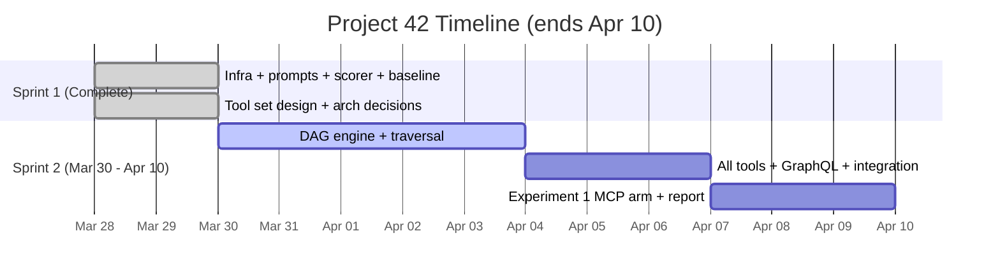
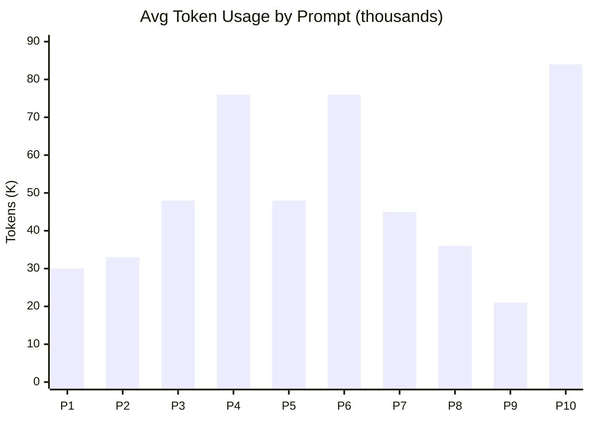

# Project 42: Terraform Smart Context MCP Server -- Progress Report

**Course:** CS 6650 -- Distributed Systems, Northeastern University Vancouver | **Date:** March 29, 2026
**Team:** Kalhar Pandya, Vinal Dsouza, Parin Shah
**Repo:** [github.com/KalharPandya/terraform-smart-context-mcp-42](https://github.com/KalharPandya/terraform-smart-context-mcp-42) | **Board:** [GitHub Projects](https://github.com/users/KalharPandya/projects/1)

## 1. Problem, Team, and Overview of Experiments

LLMs are increasingly used as infrastructure operators, but querying what is *actually deployed* fails three ways: **(1)** `terraform show -json` on 75 resources produces 4,041 lines (~33K tokens) -- too large for context windows; **(2)** every interaction starts blind; **(3)** agents hallucinate without structured access. Code editing agents solved this for programming with tools like `read_file`. Project 42 builds that equivalent for Terraform -- an MCP server giving any AI agent structured, token-efficient access to live infrastructure.

**The core difference:** Raw CLI dumps full state (~33K tokens) into context. Our MCP server returns filtered subgraphs (~200 tokens per call). Example: `list_resources(type=subnet)` returns 8 subnets instead of the entire state.

**Stakeholders:** DevOps teams at scale, platform engineers, orgs with 50+ Terraform resources.

**Team:** Kalhar Pandya (MCP implementation, architecture, TypeScript/MCP SDK), Vinal Dsouza (AI-first workflow, Claude Code automations, coordination), Parin Shah (protocol design, experiments, scorer implementation). All MS CS at NEU Vancouver.

**Experiments:** Three experiments evaluate MCP tools vs raw CLI. Metrics: accuracy, tokens, cost, tool calls, latency. **(1)** Tool-Augmented vs Raw State (baseline complete); **(2)** Abstraction Granularity (designed); **(3)** Cross-Model Portability across 15 models (designed). AI plays a dual role: development tool (Claude Code with 7 commands, 5 skills) and experiment subject.

**Observability:** `runner.ts` captures per-trial metrics from CLI stream. MCP server (planned): structured JSON logging per tool call. `visualize.ts` generates 6-chart Chart.js dashboard.

## 2. Project Plan and Progress

**Deadline: April 10, 2026.** Two sprints, 23 GitHub issues.

**Who does what:** Kalhar -- DAG engine, all 12 tools (#17-#23). Vinal -- Claude Code automations (#1-#6), docs. Parin -- Experiment 1 MCP arm, scorer refinements.

**v1 Tool Set (12 tools):** 5 DAG tools (`list_resources`, `get_resource`, `get_dependencies`, `filter_resources`, `count_resources`), 2 GraphQL tools (`query_graph`, `get_schema`), 5 CLI wrappers (`terraform_init/validate/plan/apply/output`). DAG tools return filtered subgraphs from an in-memory graph built from `terraform show -json`. GraphQL provides an escape hatch for complex ad-hoc queries.

**AI cost/benefit:** Baseline experiment cost $1.73 (30 trials, 1.49M tokens). 3-person team shipped full experiment infra, 12-tool architecture, and 5 resolved decisions in one sprint via Claude Code-first development.

## 3. Claude Code-First Development

We experiment with **Claude Code-first development cycles** -- 7 slash commands and 5 auto-loading domain skills. Session cycle: `/start-session` (load team context, 48h git log) -> `/review-design` (validate against DECISIONS.md) -> development with `/commit-decision` (immediate, append-only) and `/sync-context` (blockers) -> `/review-code` + `/review-pr` (rule-based gates, every finding cites a rule) -> `/end-session` (sync + push). Domain skills: `terraform-parsing`, `dag-design`, `mcp-server-patterns`, `context-reduction`, `code-review`. Humans make decisions; Claude Code documents, enforces, and broadcasts them. **Context sharing over coding speed.**

## 4. Objectives

**Short-term (Apr 10):** v1 with 12 tools, ~6x token reduction ($0.058 -> ~$0.012/query), Experiment 1 complete.
**Long-term:** Cross-model portability (15 models), v2 HCL parsing, open-source release, CI/CD integration.
**Reliability:** DAG caching, GraphQL guards (depth <= 3, 50 nodes, 5s timeout), structured logging. Projected savings at 100 queries/day: $1,679/year per project.

## 5. Related Work

Anthropic open-sourced MCP in Nov 2024 [1] as JSON-RPC 2.0 protocol for AI-tool integration [2], adopted by Block, Apollo, Zed, Sourcegraph [3]. Gorilla [4] and BFCL [5] show structured tools reduce hallucination; ToolACE [6] proved tool design matters more than model size. Terraform's DAG [7] is the structure we parse. "Lost in the Middle" [9] and "Context Rot" [10] show models degrade well before max context -- justifying minimal subgraphs. TerraFormer [8] showed 15-20% IaC improvement with structured feedback. MCP embodies DS fundamentals: RPC (JSON-RPC 2.0), client-server, protocol design (versioned schemas), state management (in-memory DAG). HashiCorp's MCP answers "what does this provider support?" (docs). Ours answers "what is deployed?" (live state).

[1] Anthropic, "Introducing MCP," Nov 2024. [2] MCP Spec, 2025. [3] InfoQ, Dec 2024. [4] Patil et al., "Gorilla," 2023. [5] Patil et al., "BFCL," ICML 2025. [6] Team-ACE, "ToolACE," 2024. [7] HashiCorp, "Terraform Resource Graph." [8] Jana et al., "TerraFormer," 2026. [9] Liu et al., "Lost in the Middle," TACL 2024. [10] Chroma, "Context Rot," 2025.

## 6. Methodology and Hypothesis

**Hypothesis:** Purpose-built MCP tools will reduce token consumption by 5-6x while maintaining accuracy. We predicted hard accuracy at 10-30%; actual: **94%**. Revised thesis: at 75-resource scale the problem is **cost/context inefficiency**, not accuracy collapse.

| Difficulty | Predicted Acc. | Actual | Pred. Tokens | Actual |
|-----------|---------------|--------|-------------|--------|
| Easy | 80-100% | **83%** | 5-15K | **28K** |
| Medium | 50-75% | **75%** | 15-30K | **44K** |
| Hard | 10-30% | **94%** | 30-50K | **79K** |

**Infrastructure:** 75 `null_resource` across 6 modules (networking=15, security=14, compute=16, database=10, loadbalancer=10, monitoring=10), 4,041-line state, zero cloud cost. 10 prompts (3 easy, 4 medium, 3 hard). Pipeline: `runner.ts` -> `scorer.ts` -> `visualize.ts`. Temp dir per trial, `.claude/` deleted between trials.

**Experiment 1** (baseline done, MCP pending): raw CLI vs 12 MCP tools. **Experiment 2:** coarse/medium/fine tool granularity. **Experiment 3:** 15 models -- Proprietary: Claude Sonnet 4.6, Haiku 4.5, GPT-5.4, GPT-5.4 mini, o3, Gemini 2.5 Pro, Gemini 2.5 Flash, Grok 4.1 Fast, MiniMax-M2.7. Open-source: Qwen3.5-397B, DeepSeek-V3.2, Llama 4 Maverick, GLM-4.5-Air, MiMo-V2-Flash, Mistral Medium 3.

**Scoring:** `substring-match`, `set-overlap` (>=80% -> 1.0), `topological-validation` (nodes + precedence), `checklist`. Fuzzy matching with AZ short-codes and separator normalization.

## 7. Preliminary Results

10 prompts x 3 trials = 30 calls. Claude Sonnet via CLI. Total: 1,491,955 tokens, $1.73, 696.7s.

| Difficulty | Accuracy | Avg Tokens | Avg Cost | Tools | Tok/Correct |
|-----------|----------|-----------|----------|-------|-------------|
| Easy | 0.83 | 28,219 | $0.028 | 2 | 28,157 |
| Medium | 0.75 | 44,228 | $0.047 | 3 | 43,094 |
| Hard | **0.94** | 78,584 | $0.102 | 6 | 83,164 |
| **Overall** | **0.83** | **49,732** | **$0.058** | **3.5** | -- |

**Key findings:** Hard prompts cost 2.8x more tokens (28K -> 79K) with 6.9x more tool output, but maintain 94% accuracy. 97.9% of tokens are input (context accumulation). Token variance is high -- Prompt 4 scored 1.0 on all trials but ranged 51K-99K (1.9x).

**Projected MCP:** ~6x fewer tokens (49K -> ~8K), ~3x fewer tool calls (3.5 -> 1.2), ~5x cheaper ($0.058 -> ~$0.012). Deterministic responses eliminate variance.

**Remaining:** Experiment 1 MCP arm (Apr 1-7). Experiment 2 (Apr 7-9 if time). Experiment 3 (future work). Worst case: Experiment 1 only. Base case: v1 by Apr 5, experiments Apr 6-9, report Apr 10.

## 8. Impact

DevOps teams save ~$1,679/year per project at 100 queries/day. Platform engineers get deterministic responses over hallucinated configs. Terraform community gets an open-source MCP server for any client (Claude Desktop, Cursor). Classmates can test with zero cloud cost. If 6x reduction confirms, the approach generalizes to any domain with large structured state (databases, Kubernetes, cloud consoles).
