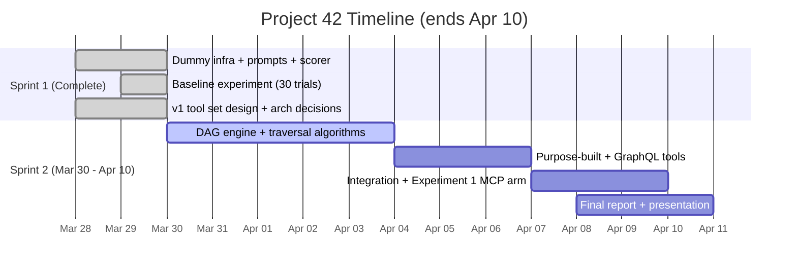

# Project 42: Terraform Smart Context MCP Server -- Progress Report

**Course:** CS 6650 -- Distributed Systems, Northeastern University Vancouver
**Team:** Kalhar Pandya, Vinal Dsouza, Parin Shah | **Date:** March 29, 2026
**Repository:** [github.com/KalharPandya/terraform-smart-context-mcp-42](https://github.com/KalharPandya/terraform-smart-context-mcp-42) | **Project Board:** [GitHub Projects -- Project 42](https://github.com/users/KalharPandya/projects/1)

---

## 1. Problem, Team, and Overview of Experiments

### 1.1 The Problem

LLMs are increasingly used as infrastructure operators, but when an LLM needs to understand what is *actually deployed*, it faces three failures: **(1)** State is too large for context windows -- `terraform show -json` on a 75-resource project produces 4,041 lines (~33K tokens); **(2)** Every interaction starts blind with no memory of what is deployed; **(3)** Agents hallucinate resource arguments without structured access to live infrastructure.

Code editing agents (Cursor, Claude Code) solved this for programming with structured tools like `read_file` and `edit_file`. Terraform has no equivalent. Project 42 builds that equivalent -- an MCP server that gives any AI agent structured, token-efficient access to live Terraform infrastructure.

**Stakeholders:** DevOps teams managing IaC at scale, platform engineering teams, and any organization using Terraform with 50+ resources where per-query cost and latency matter.

### 1.2 The Team

| Member | Role | Brings to Team |
|--------|------|---------------|
| **Kalhar Pandya** | MCP implementation, architecture | Full-stack systems, TypeScript/Node.js, MCP SDK |
| **Vinal Dsouza** | AI-first workflow, team alignment | Process design, Claude Code automations, coordination |
| **Parin Shah** | Protocol design, prompt engineering, experiments | Experiment design, scorer implementation, data collection |

### 1.3 Experiments and AI Role

Three experiments evaluate whether purpose-built MCP tools improve LLM interaction with Terraform. Metrics: **accuracy**, **token usage**, **cost**, **tool calls**, **latency**. Context Efficiency = Total Tokens / Correct Answers.

| Experiment | Question | Status |
|-----------|----------|--------|
| **1. Tool-Augmented vs. Raw State** | Do MCP tools reduce token cost while maintaining accuracy? | Baseline complete |
| **2. Abstraction Granularity** | Coarse vs. fine-grained tool responses? | Designed |
| **3. Cross-Model Portability** | Does the MCP server work across 15 models? | Designed |

AI plays a **dual role**: development tool (Claude Code with 7 slash commands, 5 domain skills) and experiment subject (the agent being tested with/without MCP tools).

### 1.4 Observability

| Layer | What We Track | How |
|-------|--------------|-----|
| **Experiment** | Tokens, cost, time, tool calls, accuracy per trial | `runner.ts` captures metrics from Claude CLI stream |
| **MCP Server** | Per-tool latency, response size, error rates | Planned: structured JSON logging per invocation |
| **Visualization** | 6-chart interactive dashboard | `visualize.ts` generates Chart.js HTML |

## 2. Project Plan and Recent Progress

### 2.1 Timeline

Project deadline: **April 10, 2026**. Two sprints. Tracked via [GitHub Projects](https://github.com/users/KalharPandya/projects/1) with 23 issues.

### 2.2 Who Is Doing What

| Member | Sprint 1 (Done) | Sprint 2 (Current) |
|--------|----------------|-------------------|
| **Kalhar** | Tool set design, architecture decisions | DAG engine, all 12 tools, integration (#17-#23) |
| **Vinal** | AI workflow design, project structure | Claude Code automation tooling (#1-#6), docs |
| **Parin** | Baseline experiment end-to-end (#12-#16) | Experiment 1 MCP arm, scorer refinements |

### 2.3 v1 Tool Set (12 tools) and Implementation Phases

| Tool | Category | Returns | Phase |
|------|----------|---------|-------|
| `list_resources` | DAG | Resources filtered by module/type, summaries only | 3 |
| `get_resource` | DAG | One resource's config + direct neighbors | 3 |
| `get_dependencies` | DAG | Dependency subgraph (depth 1-3) | 4 |
| `filter_resources` | DAG | Resources matching attribute conditions | 4 |
| `count_resources` | DAG | Counts grouped by module/type/tag | 3 |
| `query_graph` | GraphQL | Execute GraphQL query against the DAG | 6 |
| `get_schema` | GraphQL | GraphQL SDL + example queries | 6 |
| `terraform_*` (5) | CLI | init, validate, plan, apply, output | 7 |

Phases 1-2 (DAG model + traversal) are prerequisites. Phase 7 wires all 12 tools into `index.ts`.

### 2.4 AI Cost and Benefits

**Cost:** Baseline experiment $1.73 (30 trials, 1.49M tokens). Dev sessions ~$5-10 across Sprint 1.
**Benefits:** 3-person team shipped full experiment infrastructure, 12-tool architecture, and 5 resolved architecture decisions in one sprint using Claude Code-first development.

## 3. Claude Code-First Development

We experiment with **Claude Code-first development cycles** where Claude Code is the primary interface for developing, reviewing, and shipping code.

| Type | Count | Items |
|------|-------|-------|
| **Slash Commands** | 7 | `/start-session`, `/commit-decision`, `/sync-context`, `/review-design`, `/review-code`, `/review-pr`, `/end-session` |
| **Domain Skills** | 5 | `terraform-parsing`, `dag-design`, `mcp-server-patterns`, `context-reduction`, `code-review` |

Every session follows a 5-phase cycle: **start** (load team context) -> **design review** (validate against decisions) -> **development** (commit decisions immediately, sync blockers) -> **code/PR review** (rule-based, every finding cites a rule) -> **end** (sync context, push). The AI is not autonomous -- humans make decisions, Claude Code documents and enforces them. **Context sharing is the priority, not coding speed.**

## 4. Objectives

**Short-term (by April 10):** v1 MCP server with 12 tools, 6x token reduction ($0.058 -> ~$0.012/query), Experiment 1 complete (raw vs MCP).

**Long-term:** Cross-model portability (Experiment 3), real cloud support (v2 HCL parsing), open-source release, CI/CD integration.

**Observability and reliability:** DAG caching (parse once, rebuild on apply), GraphQL guards (depth <= 3, 50 node limit, 5s timeout), structured JSON logging per tool invocation, per-trial experiment metrics. For 100 queries/day, projected savings: ~$5.80/day -> ~$1.20/day ($1,679/year per project).

## 5. Related Work

Anthropic open-sourced MCP in November 2024 [1] as a JSON-RPC 2.0 protocol connecting AI assistants to external tools [2], adopted by Block, Apollo, Zed, and Sourcegraph [3]. Gorilla [4] and BFCL [5] demonstrate that structured tool interfaces reduce hallucination, and ToolACE [6] showed **tool design matters more than model size**. Terraform's internal DAG [7] is the same structure we parse and serve. "Lost in the Middle" [9] and "Context Rot" [10] show LLMs degrade well before hitting max context -- the core justification for returning minimal subgraphs. MCP embodies distributed systems fundamentals: **RPC** (JSON-RPC 2.0), **client-server** architecture, **protocol design** (versioned schemas, capability negotiation), and **state management** (in-memory DAG with session handshakes). HashiCorp's MCP server answers "what does this provider support?" (docs). Ours answers "what is deployed?" (live state). They do not overlap.

**References:** [1] Anthropic, "Introducing MCP," Nov 2024. [2] MCP Spec, 2025. [3] InfoQ, Dec 2024. [4] Patil et al., "Gorilla," arXiv 2023. [5] Patil et al., "BFCL," ICML 2025. [6] Team-ACE, "ToolACE," Sep 2024. [7] HashiCorp, "Terraform Resource Graph." [8] Jana et al., "TerraFormer," Jan 2026. [9] Liu et al., "Lost in the Middle," TACL 2024. [10] Chroma, "Context Rot," 2025.

## 6. Methodology and Hypothesis

### 6.1 Hypothesis

**Purpose-built MCP tools will reduce LLM token consumption by 5-6x while maintaining or improving accuracy.** We originally predicted hard task accuracy at 10-30%. Actual baseline: **94%**. Revised thesis: the problem at 75-resource scale is **cost and context inefficiency**, not accuracy. At 500+ resources, accuracy would degrade too.

| Difficulty | Predicted Accuracy | Actual | Predicted Tokens | Actual |
|-----------|-------------------|--------|-----------------|--------|
| Easy | 80-100% | **83%** | 5-15K | **28K** |
| Medium | 50-75% | **75%** | 15-30K | **44K** |
| Hard | 10-30% | **94%** | 30-50K | **79K** |

### 6.2 Shared Infrastructure

75 `null_resource` instances across 6 modules simulating 3-tier AWS (4,041 lines, ~33K tokens, zero cloud cost). 10 prompts (3 easy, 4 medium, 3 hard). Automated pipeline: `runner.ts` -> `scorer.ts` -> `visualize.ts`. Isolation: temp directory per trial, `.claude/` deleted between trials.

### 6.3 Experiments

**Experiment 1 (baseline done, MCP pending):** Same 10 prompts, raw CLI vs 12 MCP tools.

**Experiment 2:** Same prompts, coarse (full config) vs medium (summaries) vs fine (minimal fields) tool responses.

**Experiment 3:** Same prompts across 15 models with native tool-calling support:

| Proprietary (9) | Open-Source (6) |
|-----------------|----------------|
| Claude Sonnet 4.6, Claude Haiku 4.5 (Anthropic) | Qwen3.5-397B-A17B (Alibaba) |
| GPT-5.4, GPT-5.4 mini, o3 (OpenAI) | DeepSeek-V3.2 (DeepSeek) |
| Gemini 2.5 Pro, Gemini 2.5 Flash (Google) | Llama 4 Maverick (Meta) |
| Grok 4.1 Fast (xAI) | GLM-4.5-Air (THUDM/Zhipu) |
| MiniMax-M2.7 (MiniMax) | MiMo-V2-Flash (Xiaomi), Mistral Medium 3 (Mistral) |

### 6.4 Scoring

Four types: `substring-match` (exact values), `set-overlap` (enumeration, >=80% -> 1.0), `topological-validation` (nodes + precedence), `checklist` (planning prompts). Fuzzy matching includes AZ short-code mapping and separator-agnostic normalization.

## 7. Preliminary Results

### 7.1 Baseline (Experiment 1, Raw Arm)

10 prompts x 3 trials = 30 API calls. Claude Sonnet via CLI. Total: 1,491,955 tokens, $1.73, 696.7s.

| Difficulty | Accuracy | Avg Tokens | Avg Cost | Tool Calls | Tokens/Correct |
|-----------|----------|-----------|----------|------------|---------------|
| Easy | 0.83 | 28,219 | $0.028 | 2 | 28,157 |
| Medium | 0.75 | 44,228 | $0.047 | 3 | 43,094 |
| Hard | **0.94** | 78,584 | $0.102 | 6 | 83,164 |
| **Overall** | **0.83** | **49,732** | **$0.058** | **3.5** | -- |

```mermaid
xychart-beta
    title "Baseline: Accuracy vs Token Cost by Difficulty"
    x-axis ["Easy", "Medium", "Hard"]
    y-axis "Score / Normalized Tokens" 0 --> 1.0
    bar "Accuracy" [0.83, 0.75, 0.94]
    bar "Token Cost (normalized)" [0.36, 0.56, 1.0]
```

### 7.2 Key Findings

**Hard prompts cost 2.8x more but maintain 94% accuracy.** Token cost scales from 28K (easy) to 79K (hard), with 6.9x more tool output. **97.9% of all tokens are input** (1,460,877 / 1,491,955) -- context accumulation from prior tool outputs re-sent each turn. **Token variance is high** -- Prompt 4 scored 1.0 on all trials but ranged from 51K to 99K tokens (1.9x variance).

### 7.3 Projected MCP Improvement

| Metric | Raw CLI (actual) | MCP (projected) | Reduction |
|--------|-----------------|-----------------|-----------|
| Avg tokens/prompt | 49,732 | ~8,000 | **~6x fewer** |
| Avg tool calls | 3.5 | 1.2 | **~3x fewer** |
| Avg cost/prompt | $0.058 | ~$0.012 | **~5x cheaper** |

### 7.4 What Remains

Experiment 1 MCP arm (Apr 1-7, needs v1), Experiment 2 (Apr 7-9 if time), Experiment 3 (future work). **Worst case:** descope to Experiment 1 only. **Base case:** v1 by Apr 5, MCP experiment Apr 6-7, Experiment 2 Apr 8-9, report finalized Apr 10.

## 8. Impact

**DevOps teams** save ~$1,679/year per project on token costs at 100 queries/day. **Platform engineers** get deterministic tool responses instead of hallucinated configs. **Terraform community** gets an open-source MCP server for any MCP-compliant client (Claude Desktop, Cursor, etc.). **Classmates** can install and test with zero cloud charges (`null_resource` only). If results confirm 6x token reduction, the approach generalizes to any domain where LLMs interact with large structured state (databases, Kubernetes, cloud consoles).
