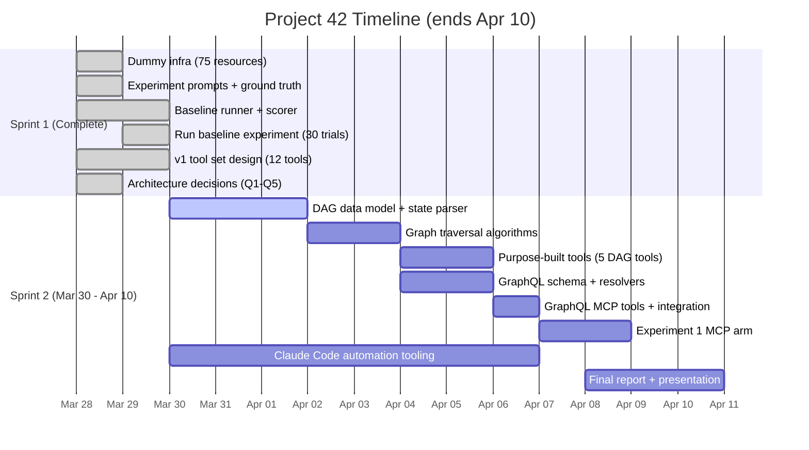
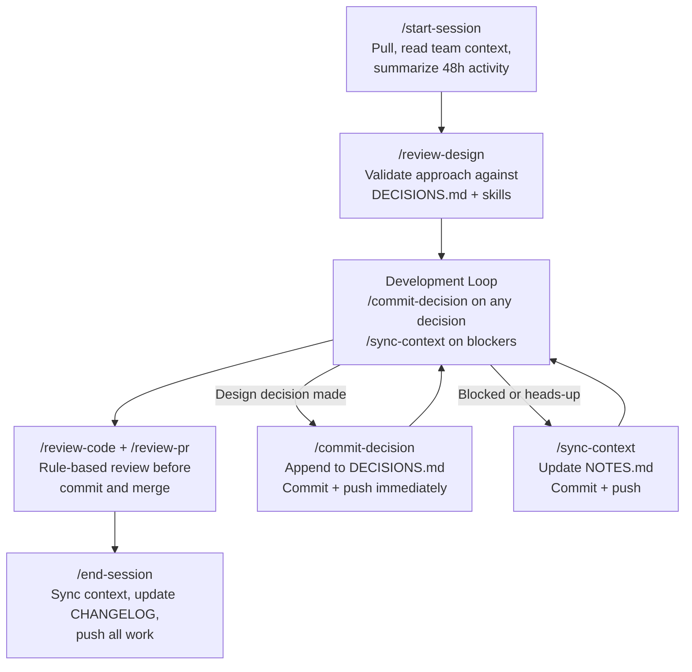
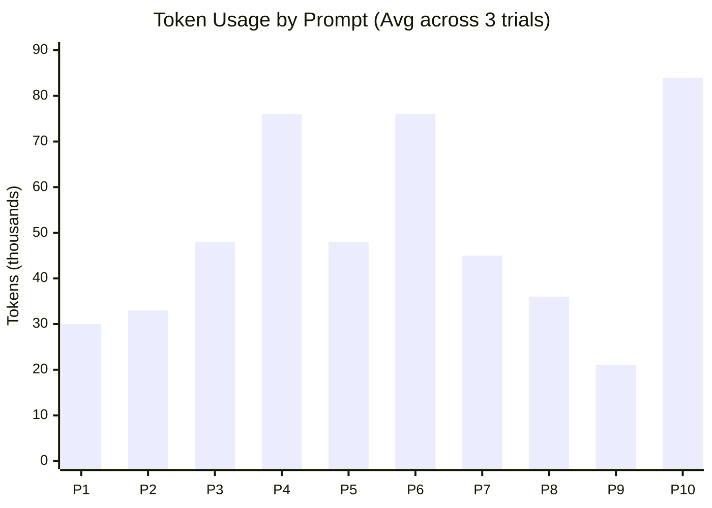

# Project 42: Terraform Smart Context MCP Server -- Progress Report

**Course:** CS 6650 -- Distributed Systems, Northeastern University Vancouver
**Team:** Kalhar Pandya, Vinal Dsouza, Parin Shah
**Date:** March 29, 2026

**Repository:** [github.com/KalharPandya/terraform-smart-context-mcp-42](https://github.com/KalharPandya/terraform-smart-context-mcp-42)
**Project Board:** [GitHub Projects -- Project 42](https://github.com/users/KalharPandya/projects/1)

---

## 1. Problem, Team, and Overview of Experiments

### 1.1 The Problem

Large Language Models are increasingly used as infrastructure operators, writing Terraform configurations, debugging deployments, and planning changes. However, when an LLM needs to understand what is *actually deployed*, it faces three specific failures:

1. **State is too large for context windows.** Running `terraform show -json` on a 75-resource project produces 4,041 lines (~33,000 tokens). A real production environment with 500+ resources produces state files that exceed any model's effective context window.

2. **Every interaction starts blind.** The agent has no memory of what is deployed, no way to inspect running services, and no access to filtered views. Each session begins from zero, requiring full state exploration.

3. **Agents guess instead of looking.** Without structured access to live infrastructure, LLMs hallucinate resource arguments, generate deprecated attributes, and produce configurations that fail against real cloud APIs.

**The analogy:** Code editing agents (Cursor, Claude Code) solved this for programming by giving the AI structured tools like `read_file`, `edit_file`, `run_terminal`. Terraform has no equivalent. There is no standard way for an agent to ask "what's deployed?" or "show me this resource's config" without getting the entire state.

**Stakeholders:** DevOps teams managing infrastructure at scale, platform engineering teams building internal developer platforms, and any organization using Terraform with 50+ resources where per-query cost and latency matter.

### 1.2 The Team

| Member | Role | Brings to Team |
|--------|------|---------------|
| **Kalhar Pandya** | Technical prototyping, MCP implementation, architecture | Full-stack systems experience, TypeScript/Node.js, MCP SDK integration |
| **Vinal Dsouza** | AI-first development workflow, team alignment, project structure | Process design, Claude Code automation workflows, team coordination |
| **Parin Shah** | Protocol design, prompt engineering, tool naming, experiments | Experiment design, scorer implementation, baseline data collection |

All members are Master's in Computer Science students at NEU Vancouver.

### 1.3 Overview of Experiments

We designed three experiments to evaluate whether purpose-built MCP tools improve LLM interaction with Terraform infrastructure:

| Experiment | Question | Status |
|-----------|----------|--------|
| **1. Tool-Augmented vs. Raw State** | Do MCP tools reduce token cost while maintaining accuracy? | Baseline complete, MCP arm pending |
| **2. Abstraction Granularity** | What is the optimal granularity: coarse (full dump) vs. fine (filtered)? | Designed, not started |
| **3. Cross-Model Portability** | Does the MCP server add value across Claude, GPT, and Gemini? | Designed, not started |

**Metrics evaluated across all experiments:**

> **Context Efficiency** = Total Tokens Used / Correct Answers

| Metric | What It Measures |
|--------|-----------------|
| Accuracy | Correctness of agent answers (scored 0.0 / 0.5 / 1.0) |
| Token Usage | Input + output tokens per query |
| Cost | USD per query (tokens x rate) |
| Tool Calls | Number of tool invocations per query |
| Latency | Wall-clock time per query |

### 1.4 Role of AI

AI plays a **dual role** in this project:

- **AI as development tool:** The entire team uses Claude Code with a structured AI-first workflow (7 slash commands, 5 domain skills) for development, code review, and decision tracking. See Section 4.
- **AI as experiment subject:** Claude (and later GPT and Gemini) is the agent being tested. We measure how its performance changes when given structured MCP tools vs. raw CLI access.

### 1.5 Observability Plan

| Layer | What We Track | How |
|-------|--------------|-----|
| **Experiment** | Tokens, cost, time, tool calls, accuracy per trial | Built into `runner.ts`, captures all metrics from Claude Code CLI stream |
| **MCP Server (planned)** | Per-tool latency, response size, error rates | Structured JSON logging per tool invocation |
| **Visualization** | 6-chart interactive dashboard | `visualize.ts` generates Chart.js HTML from scored results |
| **Cost Monitoring** | Per-prompt and aggregate cost tracking | CLI `--max-budget-usd` guard + post-hoc cost analysis |

---

## 2. Project Plan and Recent Progress

### 2.1 Timeline

Project deadline: **April 10, 2026**. Two sprints total.



### 2.2 Recent Progress (Sprint 1 -- Complete)

| Deliverable | Issue(s) | Owner | Status |
|------------|----------|-------|--------|
| 75-resource dummy Terraform infrastructure | #12 | Parin | Done |
| 10 experiment prompts with ground truth | #13 | Parin | Done |
| Experiment runner (CLI headless mode) | #14 | Kalhar, Parin | Done |
| Experiment scorer (4 scoring types) | #15 | Parin | Done |
| Chart.js visualization pipeline | -- | Parin | Done |
| Baseline experiment (30 trials, $1.73) | #16 | Parin | Done |
| v1 tool set design (12 tools) | -- | Kalhar | Done |
| 5 architecture decisions (Q1-Q5) | #7-#11 | Kalhar | Done |
| GitHub issues #17-#23 for implementation | -- | Kalhar | Done |

### 2.3 Who Is Doing What

| Member | Sprint 1 (Done) | Sprint 2 (Current) |
|--------|----------------|-------------------|
| **Kalhar** | Tool set design, architecture decisions | DAG engine, purpose-built tools, GraphQL, integration (#17-#23) |
| **Vinal** | AI workflow design, project structure | Claude Code automation tooling (#1-#6), testing, documentation |
| **Parin** | Baseline experiment end-to-end (#12-#16) | Experiment 1 MCP arm, scorer refinements, final experiments |

### 2.4 AI Cost and Benefits in Development

**Cost:**
- Baseline experiment: **$1.73** for 30 trials (1.49M tokens total)
- Development sessions: Claude Code API costs during iterative development (~$5-10 estimated across Sprint 1)

**Benefits:**
- A 3-person team shipped the full experiment infrastructure (dummy infra, runner, scorer, visualizer), 12-tool architecture design, and 5 resolved architecture decisions in **one sprint** using Claude Code-first development
- AI-first code review workflow catches decision violations before commit (zero post-merge decision conflicts)
- Automated decision capture ensures all 12 decisions in `DECISIONS.md` are immediately visible to all team members

---

## 3. Project Plan (Detailed)

The full project plan is tracked via [GitHub Projects -- Project 42](https://github.com/users/KalharPandya/projects/1) with 23 issues across 2 sprints.

### 3.1 Implementation Phases (#17-#23)

| Phase | Issue | Description | Dependencies |
|-------|-------|-------------|-------------|
| 1 | #17 | DAG data model, state parser, precomputed indexes | None |
| 2 | #18 | Graph traversal algorithms (BFS, path, impact, topo sort) | Phase 1 |
| 3 | #19 | Purpose-built tools: `list_resources`, `get_resource`, `count_resources` | Phase 2 |
| 4 | #20 | Purpose-built tools: `get_dependencies`, `filter_resources` | Phase 2 |
| 5 | #21 | GraphQL schema, resolvers, validation guards | Phase 2 |
| 6 | #22 | GraphQL MCP tools: `query_graph`, `get_schema` | Phase 5 |
| 7 | #23 | Integration: wire 12 tools into `index.ts`, extract CLI, drop `state_list` | Phases 3-6 |

### 3.2 v1 Tool Set (12 tools)

| # | Tool | Category | What It Returns |
|---|------|----------|----------------|
| 1 | `list_resources` | DAG | Resources filtered by module/type, summaries only, never full state |
| 2 | `get_resource` | DAG | One resource's config + direct neighbors |
| 3 | `get_dependencies` | DAG | Dependency subgraph (depth 1-3) |
| 4 | `filter_resources` | DAG | Resources matching attribute conditions |
| 5 | `count_resources` | DAG | Counts grouped by module/type/tag |
| 6 | `query_graph` | GraphQL | Execute GraphQL query against the DAG |
| 7 | `get_schema` | GraphQL | Return GraphQL SDL + example queries |
| 8-12 | `terraform_*` | CLI | init, validate, plan, apply, output |

---

## 4. Claude Code-First Development

We are experimenting with **Claude Code-first development cycles**, a structured AI-first workflow where Claude Code is not just a coding assistant but the primary interface through which the team develops, reviews, and ships code.

### 4.1 Automation Inventory

| Type | Count | Examples |
|------|-------|---------|
| **Slash Commands** | 7 | `/start-session`, `/commit-decision`, `/sync-context`, `/review-design`, `/review-code`, `/review-pr`, `/end-session` |
| **Domain Skills** | 5 | `terraform-parsing`, `dag-design`, `mcp-server-patterns`, `context-reduction`, `code-review` |
| **Config** | 1 | `settings.local.json` (permission rules) |
| **Total** | **13 automation files** | All in `.claude/` directory |

### 4.2 Session Lifecycle

Every development session follows a 5-phase cycle enforced by slash commands:



### 4.3 Key Design Principles

- **Rule-based review, not subjective feedback:** Every review finding must cite a `DECISIONS.md` entry or skill convention. No opinion-based suggestions.
- **Immediate decision capture:** `/commit-decision` runs at the moment of decision, not at end of session. Teammates see it on next `git pull`.
- **Context hierarchy:** `git log` > `DECISIONS.md` > `NOTES.md`. When sources conflict, trust the higher-ranked one.
- **Domain skills auto-load:** When working on `.tf` files, the `terraform-parsing` skill loads automatically. When reviewing code, the `code-review` skill provides the 6-category review framework. No manual invocation needed.

### 4.4 Insight

The AI is not autonomous. The human makes design decisions; Claude Code documents them immediately, enforces them during review, and broadcasts them to teammates. **Context sharing is the priority, not coding speed.** This workflow treats teammates' visibility of decisions and blockers as higher priority than individual developer velocity.

---

## 5. Objectives

### 5.1 Short-Term (Course Timeline, by April 10)

- **v1 MCP server** with 12 tools (5 DAG + 2 GraphQL + 5 CLI) serving filtered subgraphs from Terraform state
- **6x token reduction** on baseline experiment prompts ($0.058 per query down to ~$0.012)
- All 10 experiment prompts answerable via purpose-built tools with correct ground truth
- Complete Experiment 1 (raw vs MCP comparison) with statistical significance (3+ trials per prompt)

### 5.2 Long-Term (Beyond Course)

- **Cross-model portability:** Validate that the same MCP tools work across Claude, GPT, and Gemini (Experiment 3)
- **Real cloud support:** v2 parses raw HCL files (not just `terraform show -json` state), enabling pre-apply analysis
- **Open-source release:** Publish as an installable MCP server for the Terraform community
- **CI/CD integration:** MCP server as a pipeline step where agents query infrastructure state during deployment review

### 5.3 Observability and Reliability

| Concern | Mechanism | Detail |
|---------|-----------|--------|
| **Performance** | DAG caching | Parse state once on first tool call, cache in-memory; rebuild only after `terraform_apply` |
| **Reliability** | Guard limits | GraphQL: depth <= 3, node count <= 50, 5s execution timeout |
| **Cost Control** | Token efficiency | Every tool response includes a `summary` string; purpose-built tools return filtered views, not full state |
| **Monitoring** | Structured logging | Planned: JSON log per tool invocation with `{tool, latency_ms, response_size, error}` |
| **Experiment Tracking** | Per-trial metrics | Runner captures tokens, cost, time, tool calls, answer per trial |

### 5.4 Cost Control for Stakeholders

At baseline, a complex infrastructure query costs **$0.10+** and **79K tokens**. With MCP tools, we project:

> **Cost reduction:** $0.058 / $0.012 = ~5x cheaper per query
>
> **Token reduction:** 49,732 / 8,000 = ~6x fewer tokens per query

For an organization running 100 agent queries/day, this translates from ~$5.80/day to ~$1.20/day, a $1,679/year saving on a single project.

---

## 6. Related Work

### 6.1 Model Context Protocol

Anthropic open-sourced MCP in November 2024 as a standard for connecting AI assistants to external data sources and tools [1]. The protocol uses JSON-RPC 2.0 over stdio or SSE transport, defining three server primitives: Prompts, Resources, and Tools [2]. Early adopters include Block, Apollo, Zed, Replit, and Sourcegraph [3]. Our project implements an MCP server specifically for Terraform infrastructure, a domain not covered by existing MCP servers.

### 6.2 LLM Tool Use and Function Calling

Research shows that structured tool access significantly reduces LLM hallucination compared to raw text generation. Gorilla [4] demonstrated that LLMs fine-tuned for API calling surpass GPT-4 at generating correct API calls. The Berkeley Function Calling Leaderboard (BFCL) [5] is the standard benchmark for evaluating tool-calling accuracy across serial, parallel, and multi-turn scenarios, the same patterns our MCP tools target. ToolACE [6] showed that even 8B-parameter models achieve state-of-the-art tool use with well-structured interfaces, validating that **tool design matters more than model size**.

### 6.3 Infrastructure as Code

Terraform uses an internal directed acyclic graph (DAG) for dependency resolution [7], the same graph structure our MCP server parses and serves to LLMs. TerraFormer [8] demonstrated a 15-20% improvement in LLM-driven Terraform code generation using structured feedback, validating the active research interest in LLM-IaC integration.

### 6.4 Context Window Limitations

"Lost in the Middle" [9] showed that LLMs exhibit a U-shaped attention curve: they attend well to the beginning and end of context but degrade on information in the middle. "Context Rot" [10] tested 18 frontier models and found **every model degrades well before hitting its maximum context window**, with a 200K-token model showing significant degradation at 50K tokens. This is the core empirical justification for our approach: return minimal, targeted subgraphs rather than dumping entire state.

### 6.5 Distributed Systems Concepts

MCP directly embodies several distributed systems fundamentals from this course:

| Concept | How It Appears |
|---------|---------------|
| **RPC** | MCP is built on JSON-RPC 2.0. Each tool invocation is a remote procedure call with typed parameters and return values |
| **Client-Server** | The AI application (Claude, Cursor) is the client; our MCP server exposes tools, resources, and prompts |
| **Protocol Design** | MCP defines versioned schemas, capability negotiation, and typed message formats, analogous to IDLs |
| **State Management** | The server maintains a parsed DAG in memory as server-side state, with session initialization handshakes |

### 6.6 HashiCorp terraform-mcp-server

HashiCorp released their own MCP server for Terraform, but it serves a fundamentally different purpose:

| | HashiCorp MCP | Project 42 |
|---|---|---|
| **Answers** | "What arguments does `aws_instance` accept?" | "What is deployed in MY environment?" |
| **Data source** | Terraform Registry API (documentation) | Live Terraform state + CLI |
| **Dependency graph** | No | Yes (core feature) |
| **Filtered views** | No | Yes (purpose-built tools) |

HashiCorp's MCP is a documentation tool. Ours is an infrastructure introspection tool. They do not overlap in problem space.

### References

[1] Anthropic, "Introducing the Model Context Protocol," Nov 2024. https://www.anthropic.com/news/model-context-protocol
[2] Model Context Protocol Specification, 2025. https://modelcontextprotocol.io/specification/2025-11-25
[3] S. De Simone, "Anthropic Publishes Model Context Protocol Specification," InfoQ, Dec 2024.
[4] S. Patil et al., "Gorilla: Large Language Model Connected with Massive APIs," arXiv 2023.
[5] S. Patil et al., "The Berkeley Function Calling Leaderboard," ICML 2025.
[6] Team-ACE, "ToolACE: Winning the Points of LLM Function Calling," Sep 2024.
[7] HashiCorp, "Terraform Resource Graph." https://developer.hashicorp.com/terraform/internals/graph
[8] P. Jana et al., "TerraFormer: Automated IaC with LLMs," Jan 2026.
[9] N. Liu et al., "Lost in the Middle: How Language Models Use Long Contexts," TACL 2024.
[10] Chroma Research, "Context Rot: How Increasing Input Tokens Impacts LLM Performance," 2025.

---

## 7. Hypothesis

### 7.1 Primary Hypothesis

**Purpose-built MCP tools that serve filtered, pre-processed subgraphs from Terraform state will reduce LLM token consumption by 5-6x while maintaining or improving task accuracy, compared to raw CLI access.**

### 7.2 Original Predictions (Pre-Experiment)

We predicted that raw CLI performance would degrade sharply on hard tasks:

| Difficulty | Predicted Accuracy | Predicted Avg Tokens | Predicted Tool Calls |
|-----------|-------------------|---------------------|---------------------|
| Easy | 80-100% | 5-15K | 2-4 |
| Medium | 50-75% | 15-30K | 5-8 |
| Hard | 10-30% | 30-50K | 8-15 |

The reasoning: hard infrastructure questions (dependency chains, impact analysis, deployment order) force iterative state exploration that floods the context window, causing accuracy to collapse.

### 7.3 Revised Hypothesis (Post-Baseline)

The baseline experiment **partially confirmed and partially surprised us**:

| Difficulty | Predicted Accuracy | Actual Accuracy | Predicted Tokens | Actual Tokens |
|-----------|-------------------|----------------|-----------------|--------------|
| Easy | 80-100% | **83%** (confirmed) | 5-15K | **28K** (higher than predicted) |
| Medium | 50-75% | **75%** (confirmed) | 15-30K | **44K** (higher than predicted) |
| Hard | 10-30% | **94%** (not confirmed) | 30-50K | **79K** (much higher) |

**What we got right:** Token cost scales with difficulty (2.8x from easy to hard). Medium accuracy matches prediction.

**What surprised us:** Hard prompts scored *higher* than medium (94% vs 75%). Claude Sonnet handles multi-hop reasoning well even with raw CLI tools, but at enormous token cost.

**Revised thesis:** At 75-resource scale, the raw CLI problem is **cost, latency, and context inefficiency**, not accuracy degradation. However, at real-world scale (500+ resources), context overflow would force truncation and *then* accuracy would degrade. The MCP tools solve both: reduce cost now, prevent accuracy collapse at scale.

### 7.4 MCP Tool Hypotheses (To Be Tested)

| Hypothesis | How We Test It | Expected Result |
|-----------|---------------|-----------------|
| MCP tools reduce tokens per query by 5-6x | Same 10 prompts, raw vs MCP arms | 49K avg down to ~8K avg |
| MCP tools reduce tool calls by 3x | Count tool invocations per prompt | 3.5 avg down to ~1.2 avg |
| MCP tools eliminate token variance | Compare trial-to-trial variance | High (2-3x) down to near-zero (deterministic responses) |
| MCP tools fix Prompt 3 (scored 0.00 in baseline) | `get_dependencies("vpc", direction: "dependents", depth: 1)` | Exact set returned, no ambiguity |
| MCP tools collapse Prompt 6 cost ($0.125 avg) | `query_graph` with `path(from, to)` | Single call, ~$0.01, deterministic chain |

---

## 8. Methodology

### 8.1 Experiment Infrastructure

All experiments share a common infrastructure:

- **Dummy Terraform project:** 75 `null_resource` instances across 6 modules (networking, security, compute, database, loadbalancer, monitoring) simulating a 3-tier AWS deployment. Produces 4,041 lines of state JSON (~33K tokens). Zero cloud charges.
- **10 task prompts** spanning 3 difficulty levels and 9 categories, with ground truth answers and 4 scoring types
- **Automated pipeline:** `runner.ts` -> `scorer.ts` -> `visualize.ts`

### 8.2 Experiment 1: Tool-Augmented vs. Raw State

**Design:** Same 10 prompts, same infrastructure. Two arms:
- **Raw arm (complete):** Agent has only Bash tool, runs `terraform state list`, `terraform show -json`, etc.
- **MCP arm (pending v1):** Agent has 12 MCP tools: `list_resources`, `get_dependencies`, `query_graph`, etc.

**Isolation:** Each trial runs in a temporary directory with only `.tf` files copied in (no README, no prompts.json). The `.claude/` directory is deleted between trials to prevent cross-trial context leakage.

### 8.3 Experiment 2: Abstraction Granularity

**Design:** Same prompts, three tool granularity levels:
- **Coarse:** Tools return full resource configurations (all attributes)
- **Medium:** Tools return summaries + key attributes only
- **Fine:** Tools return minimal fields (ID, type, summary string)

**Tradeoff evaluated:** Fewer tokens vs. risk of insufficient context for complex queries.

### 8.4 Experiment 3: Cross-Model Portability

**Design:** Same prompts through the MCP server, connected to:
- Claude (Sonnet)
- GPT-4
- Gemini Pro

**Tradeoff evaluated:** Whether the MCP abstraction is model-agnostic or biased toward one provider's tool-calling patterns.

### 8.5 Scoring Framework

| Type | Used For | Scoring |
|------|----------|---------|
| `substring-match` | Attribute lookups (exact values) | >=100% found -> 1.0, >=50% -> 0.5, else 0.0 |
| `set-overlap` | Enumeration, dependency lists | >=80% matched -> 1.0, >=50% -> 0.5, else 0.0 |
| `topological-validation` | Deployment order, dependency chains | Nodes found (50%) + precedence rules (50%), threshold 0.8 |
| `checklist` | Planning, inventory prompts | >=min_for_full -> 1.0, >=min_for_partial -> 0.5 |

Fuzzy matching includes AZ short-code mapping (`us-east-1a` to `use1-az1`), separator-agnostic number matching, and compact form normalization.

---

## 9. Preliminary Results

### 9.1 Baseline Experiment (Experiment 1, Raw Arm)

**Metadata:** 10 prompts x 3 trials = 30 API calls. Claude Sonnet via CLI. Total: 1,491,955 tokens, $1.73, 696.7 seconds.

| Difficulty | Accuracy | Avg Tokens | Avg Cost | Avg Tool Calls | Tokens/Correct Answer |
|-----------|----------|-----------|----------|---------------|----------------------|
| Easy | 0.83 | 28,219 | $0.028 | 2 | 28,157 |
| Medium | 0.75 | 44,228 | $0.047 | 3 | 43,094 |
| Hard | **0.94** | 78,584 | $0.102 | 6 | 83,164 |
| **Overall** | **0.83** | **49,732** | **$0.058** | **3.5** | -- |


### 9.2 Key Findings

**Finding 1: Hard prompts maintain high accuracy but at 2.8x token cost.**

| | Easy | Hard | Ratio |
|---|------|------|-------|
| Accuracy | 0.83 | 0.94 | 1.1x |
| Tokens | 28K | 79K | **2.8x** |
| Cost | $0.028 | $0.102 | **3.6x** |
| Tool calls | 2 | 6 | **3x** |
| Tool output | 5K chars | 34K chars | **6.9x** |

The initial hypothesis predicted hard accuracy at 10-30%. Actual: **94%**. The problem at 75-resource scale is not accuracy degradation, it is **cost and latency explosion**.

**Finding 2: 97.9% of all tokens are input (context accumulation).**

> Input tokens / Total tokens = 1,460,877 / 1,491,955 = **97.9%**

As Claude makes more tool calls, the accumulated conversation history (with all prior tool outputs) is re-sent with each API call. This is the core inefficiency MCP tools address: by returning pre-filtered, smaller responses, each turn accumulates less context.

**Finding 3: Token variance is high across trials for the same prompt.**

Prompt 4 (impact analysis) scored 1.0 on all 3 trials, but token usage ranged from 51K to 99K, a **1.9x variance** for identical results. This non-deterministic cost is problematic for production use and is eliminated by deterministic MCP tool responses.



### 9.3 Projected MCP Improvement

| Metric | Raw CLI (actual) | MCP (projected) | Reduction |
|--------|-----------------|-----------------|-----------|
| Avg tokens/prompt | 49,732 | ~8,000 | **~6x fewer** |
| Avg tool calls | 3.5 | 1.2 | **~3x fewer** |
| Avg cost/prompt | $0.058 | ~$0.012 | **~5x cheaper** |
| Token variance | High (2-3x) | Low (deterministic) | Stable |

### 9.4 What Remains

| Item | Depends On | Timeline |
|------|-----------|----------|
| Experiment 1, MCP arm | v1 implementation (Phases 1-7) | Apr 1-7 |
| Experiment 2, Granularity | v1 + tool response variants | Apr 7-9 (if time permits) |
| Experiment 3, Cross-model | v1 + GPT/Gemini API integration | Future work |
| Scorer refinements | Prompt 3 failure analysis | Apr 1-2 |

**Worst-case workload:** If v1 implementation takes longer than expected, Experiments 2 and 3 will be descoped. Experiment 1 alone (raw vs MCP comparison) validates the core thesis. Experiments 2 and 3 become concrete future work.

**Base-case workload:** v1 completes by Apr 5, Experiment 1 MCP arm runs Apr 6-7, Experiment 2 runs Apr 8-9, report finalized Apr 10.

---

## 10. Impact

### 10.1 Who Cares

- **DevOps teams:** At 100 agent queries/day, MCP tools save ~$1,679/year per project on token costs alone. At enterprise scale (10+ projects), savings multiply.
- **Platform engineers:** Deterministic, filtered tool responses mean agents produce reliable infrastructure changes, not hallucinated configurations.
- **Terraform community:** An open-source MCP server that any Terraform user can install and connect from Claude Desktop, Claude Code, Cursor, or any MCP-compliant client.
- **LLM tool developers:** Our experiment data provides concrete evidence for how purpose-built tools vs. raw CLI access affects token cost, accuracy, and latency, applicable beyond Terraform.

### 10.2 Classmate Usability

Anyone with **Terraform CLI + Node.js** can install and test the MCP server:

```bash
git clone https://github.com/KalharPandya/terraform-smart-context-mcp-42
cd terraform-smart-context-mcp-42 && npm install
cd experiments/baseline/dummy-infra && terraform init && terraform apply -auto-approve
```

The dummy infrastructure uses only `null_resource`, **zero cloud charges**, instant apply. Connect the MCP server to Claude Desktop or Cursor and query the 75-resource infrastructure through purpose-built tools.

### 10.3 Broader Significance

This is one of the first MCP servers that provides structured access to **live infrastructure state**, not just documentation. HashiCorp's MCP server answers "what does this provider support?" Ours answers "what is actually deployed?" If the experiment results confirm the projected 6x token reduction, the approach generalizes to any domain where LLMs interact with large structured state (databases, Kubernetes clusters, cloud consoles).
